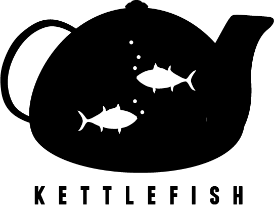

# kettlefish



# Getting started
Kettlefish is a very simple boilerplate for fussy lazy web devs.

[Demo](http://htmlpreview.github.io/?https://github.com/paulbrzeski/kettlefish/blob/master/index.html)

## Features
- Simple low maintenance configuration, works out of the box.
- [Pug](https://pugjs.org/) for HTML.
  - The [templates](/src/templates) folder contains page layouts, scripts blocks, etc and the [pages](/src/pages) folder creates the HTML structure of the site at the root, this is why there's a rogue index.html file in this repository. 
- [Stylus for CSS](http://stylus-lang.com/)
  - The [styles](/src/styles) folder compiles into CSS, as you'll note in the `css` script below, any files defined in `/src/styles` are compiled to CSS in `/dist`.
- Example sites for even faster site building (coming soon)
  - For now, I've re-implemented the Semantic UI homepage demo using Kettlefish - [demo here](http://htmlpreview.github.io/?https://github.com/paulbrzeski/kettlefish/blob/master/index.html).


## Local or global installation
Kettlefish can be installed globally so it can run from anywhere
```
npm install -g kettlefish
```
# Usage
If you're aware of some or all of the buzzwords in the features list, you're going to have a good time with this boilerplate. If not, feel free to post issues asking how to do things unrelated to this project.

Kettlefish is a multi purpose static site generator.

Out of the box, you can start a new site using this as a base - you'll have everything you need to do anything. If you're a CMS developer, you can use this to implement a design first and then integrate it into your development pipeline.

## As a boilerplate
Simply copy the contents of Kettlefish into your starter project or install it as a node_module as a reference.

## Developing static sites
Kettlefish comes with a script that will watch for changes to Pug, Stylus and JS files and rebuild them. A simply HTTP server is also run to preview in a browser.

```<kettlefish project root> node dev.js```

## As a global CLI tool
If you install Kettlefish globally, you can use it as a multipurpose static generator for things like project documentation or invoicing.

The default target directory is the current folder, but a path argument can also be passed in.
```<kettlefish compatible folder root> kf .```
###### OR
```<kettlefish compatible folder root> kettlefish .```

## Scripts
Kettlefish comes with a couple of handy scripts out of the box. They are the basis for key tasks and bound to package.json which you are welcome to use as a starting point for your own project.	
```	@TODO: Complete this section
  "scripts": {	- Dev script / watch mode
    "build": "pug src/pages -P -o . -b . && stylus src/styles -o dist",	- Compiler / run once
    "css": "stylus src/styles -o dist -w",	
    "pug": "pug src/pages -P -o . -b . -w",	
    "dev-osx": "sudo http-server -p 80 -c-1 .",	
    "dev": "http-server -p 80 -c-1 .",	
    "watch": "npm run css & npm run pug & npm run rollup & npm run dev",	
    "gs": "for i in ../*; do (cd $i && (echo $i; git status)); done",	
    "preinstall": "npm i -g http-server"	
  }	
```
